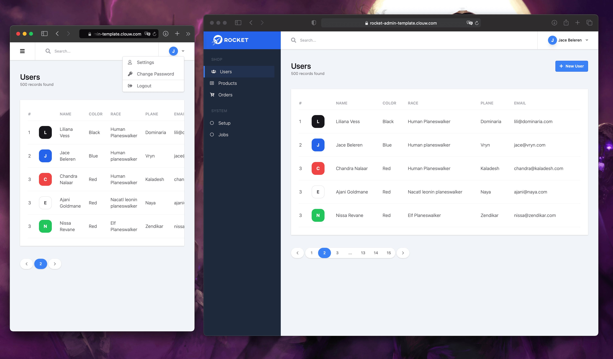

# Rocket admin template


# Preview

### Screenshot



### Demo Site: [[Here]](https://ramon-sg.github.io/rocket-admin-template/)

## Features

- **Astro**
- **Tailwind CSS**
- **Alpinejs**

## How to Use

In your terminal, run the following command

```bash
bun install
# or
yarn install
```

## Run development server

```bash
bun run dev
# or
yarn dev
```

Visit [http://localhost:4321](http://localhost:4321) from your browser.

## Build for production

```bash
bun run build
# or
yarn build
```

## TODO

- [x] Responsive
- [x] Table
- [x] Dropdown Menu
- [x] Add Demo
- [ ] Forms
- [ ] Show data
- [ ] Sidebar Sub Menu
- [ ] Improve Pagination
